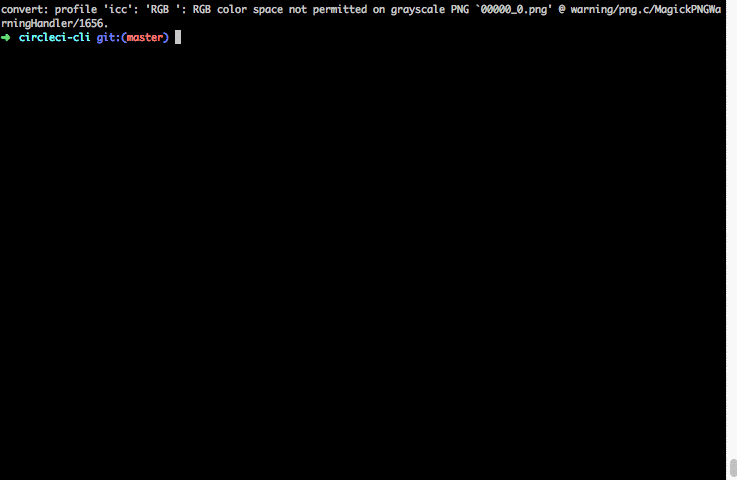

## circleci-cli [](https://circleci.com/gh/jszwedko/circleci-cli)

Command line utility for interacting with CircleCI.

Allows you to list recent builds, projects, retry builds, and more!



Currently in alpha stages so the interface may change. Feedback and feature
requests are welcome! Install and run `circleci-cli -h` to see current help
documentation.

**The CircleCI HTTP API response schemas are not well documented so please report any issues you witness**

## Installing

#### OS X (64 bit)

```bash
curl -sL https://github.com/jszwedko/circleci-cli/releases/download/0.0.1/darwin_amd64 > circleci-cli
sudo mv circleci-cli /usr/local/bin/
sudo chmod +x /usr/local/bin/circleci-cli
```

#### Linux (64 bit)

```bash
curl -sL https://github.com/jszwedko/circleci-cli/releases/download/0.0.1/linux_amd64 > circleci-cli
sudo mv circleci-cli /usr/local/bin/
sudo chmod +x /usr/local/bin/circleci-cli
```

See the [releases](https://github.com/jszwedko/circleci-cli/releases) page for additional platforms.

Set `$CIRCLE_TOKEN` to an API token (you can generate one under your account settings). Consider adding this to your `~/.profile` or shell equivalent.

Alternatively, install the latest via: `GOVENDOREXPERIMENT=1 go get
github.com/jszwedko/circleci-cli` (requires Go >= 1.5 to be installed).

### Developing

Requires Go 1.5 and
[`GOVENDOREXPERIMENT=1`](https://docs.google.com/document/d/1Bz5-UB7g2uPBdOx-rw5t9MxJwkfpx90cqG9AFL0JAYo/edit)
to properly include dependencies.

Uses [`gvt`](https://github.com/FiloSottile/gvt) to manipulate dependencies.

- Building: `make build`
- Testing: `make test`
- Building cross compiled binaries: `make dist` (will install
  [gox](https://github.com/mitchellh/gox) if needed)
